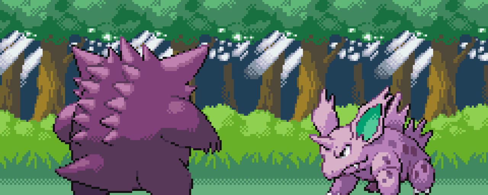

# Deep Reinforcement Learning for Pokémon Battles

Repository for training a Deep-Q-Network (DQN) to learn how to play Pokémon battles. 

## Table of Contents

- [Introduction](#introduction)
- [Installation](#installation)
- [Training](#training)
- [Future Work](#future-work)
- [License](#license)

## Introduction

TBA

## Installation

TBA

## Training

TBA

## Future Work

- Improve training speed

## License

